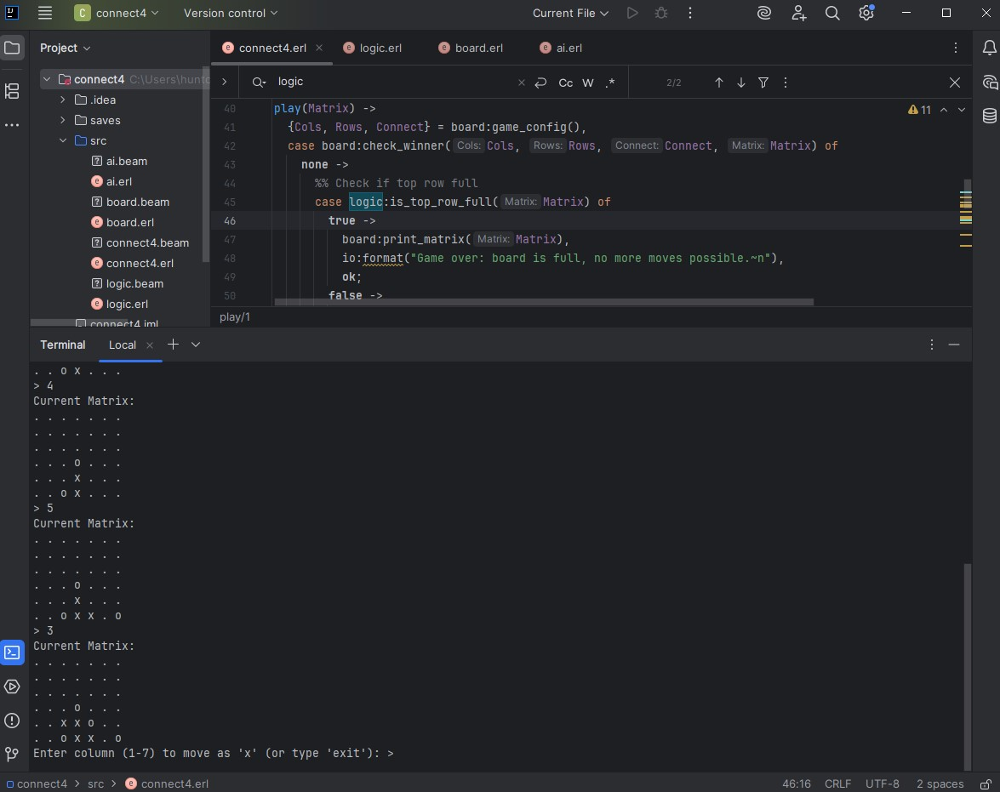

# Connect4 Game

Connect4 is a classic two-player connection game in which the players first choose a color and then take turns dropping colored discs into a seven-column, six-row vertically suspended grid. The pieces fall straight down, occupying the lowest available space within the column. The objective is to be the first to form a horizontal, vertical, or diagonal line of four of one's own discs.

## Features

- Player vs AI mode (player is `'x'` and AI is `'o'`)
- Medium difficulty AI
- Simple and intuitive game board
- Detects and announces the winner

## Game Screenshot



> Make sure the image file is placed inside an `images` folder in your project root.

## 🚀 How to Run

1. Launch Erlang on your PC with terminal:

```bash
erl

2. Load all the modules using the following commands:

c(ai).
c(logic).
c(board).
c(connect4).

3. Start the game:

connect4:start().
